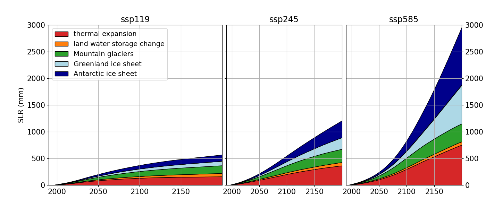

# FRISIA
FRISIA is the *Feedback-based knowledge Repository for Intergrated assessments of Sea level rise Impacts and Adaptation*. Its first published version 1.0 is fully described in Ramme et al. (in preparation). FRISIAv1.0 is developed as part of the new integrated assessment model [FRIDA](https://github.com/metno/WorldTransFRIDA) within the [WorldTrans project](https://worldtrans-horizon.eu/) of the Horizon Europe research and innovation programs under grant agreement no. 101081661. 

This repository contains:
- A class of the sea level rise (SLR) component of FRISIA that calculates global SLR based on the five most important contributors (thermosteric SLR, SLR from land water storage changes, melting of mountaing glaciers and the Greenland and Antarctic ice sheet)
- The input data needed to run the SLR and the impacts and adaptation modules of FRISIA
- An example script to run the SLR components

To be added upon submission of Ramme et al. (in preparation) to GMD:
- A class of the impacts and adaptation component of FRISIA
- An example script to run the impacts and adaptation component

The SLR component of FRISIA is largely based on MAGICC (Nauels et al., 2017) and BRICK (Wong et al., 2017). The impacts and adaptation module is a substantially modified, aggregated version of the [CIAM model](https://github.com/raddleverse/MimiCIAM.jl) (Wong et al., 2022)

## References:
- Ramme, L., Blanz, B., Wells, C., Wong, T.E., Schoenberg, W. A., Smith, C. J., Li, C.: Feedback-based sea level rise impact modelling for integrated assessment models with FRISIAv1.0, in preparation for submission to Geosci. Model Dev.
- Nauels, A., Meinshausen, M., Mengel, M., Lorbacher, K., and Wigley, T. M. L.: Synthesizing long-term sea level rise projections – the MAGICC sea level model v2.0, Geosci. Model Dev., 10, 2495–2524, https://doi.org/10.5194/gmd-10-2495-2017, 2017.
- Wong, T. E., Bakker, A. M. R., Ruckert, K., Applegate, P., Slangen, A. B. A., and Keller, K.: BRICK v0.2, a simple, accessible, and transparent model framework for climate and regional sea-level projections, Geosci. Model Dev., 10, 2741–2760, https://doi.org/10.5194/gmd-10-2741-2017, 2017
- Wong, T. E., Ledna, C., Rennels, L., Sheets, H., Errickson, F. C., Diaz, D., and Anthoff, D.: Sea Level and Socioeconomic Uncertainty Drives High-End Coastal Adaptation Costs, Earth’s Future, 10, e2022EF003 061, https://doi.org/10.1029/2022EF003061, 2022
